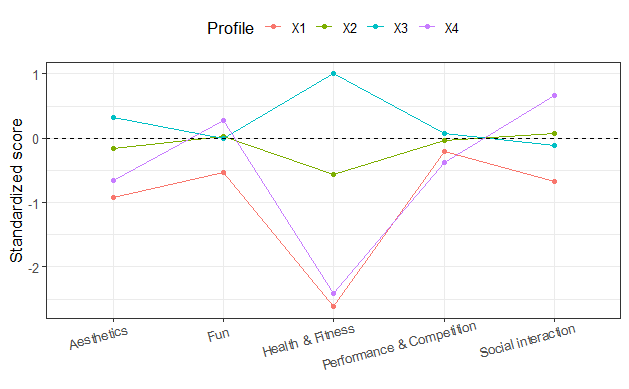

```{r, globalsettings, echo=FALSE, warning=FALSE, results='hide', message=FALSE}
library(knitr)
library(tidyverse)
knitr::opts_chunk$set(echo = TRUE)
opts_chunk$set(tidy.opts=list(width.cutoff=100),tidy=TRUE, warning = FALSE, message = FALSE,comment = "#>", cache=TRUE, class.source=c("test"), class.output=c("test3"))
options(width = 100)
rgl::setupKnitr()

colorize <- function(x, color) {sprintf("<span style='color: %s;'>%s</span>", color, x) }
```


```{r klippy, echo=FALSE, include=TRUE}
klippy::klippy(position = c('top', 'right'))
#klippy::klippy(color = 'darkred')
#klippy::klippy(tooltip_message = 'Click to copy', tooltip_success = 'Done')
```


---  


To copy the code, click the button in the upper right corner of the code-chunks.

# Getting started

## clean up

```{r, results='hide'}
rm(list=ls())
gc()
```

<br>

## general custom functions

- `fpackage.check`: Check if packages are installed (and install if not) in R
- `fsave`: Function to save data with time stamp in correct directory
- `fload`: Function to load R-objects under new names

```{r, eval=FALSE}
fpackage.check <- function(packages) {
    lapply(packages, FUN = function(x) {
        if (!require(x, character.only = TRUE)) {
            install.packages(x, dependencies = TRUE)
            library(x, character.only = TRUE)
        }
    })
}

fsave <- function(x, file, location = "./data/processed/", ...) {
    if (!dir.exists(location))
        dir.create(location)
    datename <- substr(gsub("[:-]", "", Sys.time()), 1, 8)
    totalname <- paste(location, datename, file, sep = "")
    print(paste("SAVED: ", totalname, sep = ""))
    save(x, file = totalname)
}


fload  <- function(fileName){
  load(fileName)
  get(ls()[ls() != "fileName"])
}
```

<br>

## necessary packages

- `tidyverse`: data wrangling
- `reshape2`: reshaping data
- `mlogit`: construct dataframe for multinomial logit model
- `haven`: read and write various data formats
- `sjlabelled`: work with labelled (SPSS) data
- `mclust`: latent (motivational) profile analysis
- `Hmisc`: containing `rcorr()` funciton to create correlation matrix
- `ggcorrplot`: visualize corelation matrix
- `ggplot2`

```{r, eval=FALSE}
packages = c("tidyverse", "mlogit", "haven", "sjlabelled", "mclust", "Hmisc", "ggcorrplot", "reshape2", "ggplot2")
fpackage.check(packages)
```


# I&O Panel

## load in data

Load in data of the I&O panel. Unlabel the data.

```{r}
haven::read_sav("./rawdata/DRADTRIAL22_totaal.sav") %>%
  sjlabelled::unlabel(.,verbose=F) -> df
```

<br> 


## motivations


```{r}
nrow(df[which(df$GESLACHT2==2),])

#subset motivation data
mot <- df %>%
  select(V10_1, V10_2, V10_3, V10_4, V10_5)
#and add identifier
mot$id <- 1:nrow(mot)

#also add gender
mot$gender <- df$GESLACHT2
```


<br>

descriptives

```{r}
des <- mot %>%
  select(-c(id,gender)) %>%
  gather("Variable", "value") %>%
  group_by(Variable) %>%
  summarise(Mean=mean(value,na.rm=T),
            SD=sd(value,na.rm=T),
            min=min(value,na.rm=T),
            max=max(value,na.rm=T))

des_males <- mot[which(mot$gender==1),] %>%
  select(-c(id,gender)) %>%
  gather("Variable", "value") %>%
  group_by(Variable) %>%
  summarise(Mean=mean(value,na.rm=T),
            SD=sd(value,na.rm=T),
            min=min(value,na.rm=T),
            max=max(value,na.rm=T))

des_females <- mot[which(mot$gender==2),] %>%
  select(-c(id,gender)) %>%
  gather("Variable", "value") %>%
  group_by(Variable) %>%
  summarise(Mean=mean(value,na.rm=T),
            SD=sd(value,na.rm=T),
            min=min(value,na.rm=T),
            max=max(value,na.rm=T))


des$Variable <- c("Fun", "Health and fitness", "Aesthetics", "Performance and competition", "Social interaction")
des_males$Variable <- c("Fun", "Health and fitness", "Aesthetics", "Performance and competition", "Social interaction")
des_females$Variable <- c("Fun", "Health and fitness", "Aesthetics", "Performance and competition", "Social interaction")

options(knitr.kable.NA='')
knitr::kable(des, digits=2, "html", caption="Reasons for taking part in sports") %>%
  kableExtra::kable_styling(bootstrap_options = c("striped", "hover"))

knitr::kable(des_males, digits=2, "html", caption="Males") %>%
  kableExtra::kable_styling(bootstrap_options = c("striped", "hover"))

knitr::kable(des_females, digits=2, "html", caption="Females") %>%
  kableExtra::kable_styling(bootstrap_options = c("striped", "hover"))
           
```

<br>

correlation matrix

```{r}
tab <- mot[complete.cases(mot),-c(6,7)]
names(tab) <- c("Fun", "Health and fitness", "Aesthetics", "Performance and competition", "Social interaction")
#Hmisc::rcorr(as.matrix(tab))

#visualize
ggcorrplot::ggcorrplot(cor(tab))
#rm(tab)
```


## motivaitonal clusters?

`Mclust` requires complete data. We standardize input variables, for reasons of interpretability.

```{r, eval=F}
mot %>%
  na.omit() %>% #listwise deletion
  mutate(across(!c(id,gender), scale)) -> mot.nm #standardize indicators, expect id.

```

<br>

Explore model fit by plotting BIC, ICL (optional: bootstrapped LRTS) with number of profiles (1-9)

```{r, eval=F}
BIC <- mclustBIC(mot.nm %>% select(-c(id,gender)))
ICL <- mclustICL(mot.nm %>% select(-c(id,gender)))
#LRT <- mclustBootstrapLRT(mot.nm %>%select(-id), modelName = "EEV")

plot(BIC)
plot(ICL)
summary(BIC)
summary(ICL)
```

```{r, eval=F}
m2 <- Mclust(mot.nm %>% select(-c(id,gender)), modelNames="EEV", G=2, x=BIC)
m3 <- Mclust(mot.nm %>% select(-c(id,gender)), modelNames="EEV", G=3, x=BIC)
m4 <- Mclust(mot.nm %>% select(-c(id,gender)), modelNames="EEV", G=4, x=BIC)
m5 <- Mclust(mot.nm %>% select(-c(id,gender)), modelNames="EEV", G=5, x=BIC)
m6 <- Mclust(mot.nm %>% select(-c(id,gender)), modelNames="EEV", G=6, x=BIC)
m7 <- Mclust(mot.nm %>% select(-c(id,gender)), modelNames="EEV", G=7, x=BIC)
m8 <- Mclust(mot.nm %>% select(-c(id,gender)), modelNames="EEV", G=8, x=BIC)
```

<br>

plot results, to make solution more intuitive (if solution is theoretically meaningful, we should be able to interpret the different profiles).

i use `reshape2` to extract subscale means [note: datw were transformed into standardized z-scores; thus profile means reflect SD-units above/below sample mean (which is 0)].

```{r, eval=F}
data.frame(m4$parameters$mean,stringsAsFactors = F) %>%
  rownames_to_column() %>%
  rename(Motivation = rowname) %>%
  melt(id.vars = "Motivation", variable.name = "Profile", value.name = "Mean") %>%
  mutate(Mean = round(Mean, 2),
         Mean = ifelse(Mean>1,1, Mean)#trim values exceeding +1SD
         ) -> means

#give appropriate labels
means$Motivation <- ifelse(means$Motivation=="V10_1", "Fun", ifelse(means$Motivation=="V10_2", "Health & Fitness", ifelse(means$Motivation=="V10_3", "Aesthetics", ifelse(means$Motivation=="V10_4", "Performance & Competition", ifelse(means$Motivation=="V10_5", "Social interaction", NA)))))

#plot
means %>% ggplot(aes(Motivation, Mean, group = Profile, color = Profile)) +
  geom_line() + geom_point() +
  labs(x=NULL, y="Standardized score") +
  theme_bw(base_size=14) +
  geom_hline(yintercept=0, linetype="dashed") +
  theme(axis.text.x=element_text(angle=15, hjust=.8),legend.position = "top")
```



