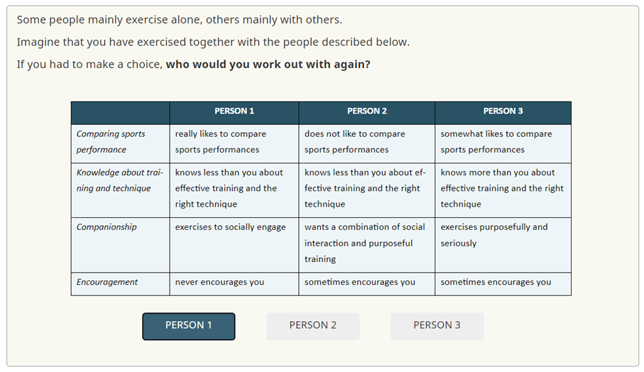

```{r, globalsettings, echo=FALSE, warning=FALSE, results='hide'}
library(knitr)

knitr::opts_chunk$set(echo = TRUE)
opts_chunk$set(tidy.opts=list(width.cutoff=100),tidy=TRUE, warning = FALSE, message = FALSE,comment = "#>", cache=TRUE, class.source=c("test"), class.output=c("test2"))
options(width = 100)
rgl::setupKnitr()


colorize <- function(x, color) {sprintf("<span style='color: %s;'>%s</span>", color, x) }

```

```{r klippy, echo=FALSE, include=TRUE}
klippy::klippy(position = c('top', 'right'))
#klippy::klippy(color = 'darkred')
#klippy::klippy(tooltip_message = 'Click to copy', tooltip_success = 'Done')
```


----

# **Replication package**
### *Choosing your sports partners!*
#### Rob Franken - Radboud University
Last compiled on `r format(Sys.time(), '%B, %Y')`


----
  

This website is a replication package for the discrete choice experiment by @Franken2022. It contains R code. 
All scripts can be found on [Github](https://github.com/robfranken/DCE_sports). 


Use the top menu to navigate through the sections.





----

## Contact  

Questions can be addressed to Rob Franken (rob.franken@ru.nl).
  
----

## References


